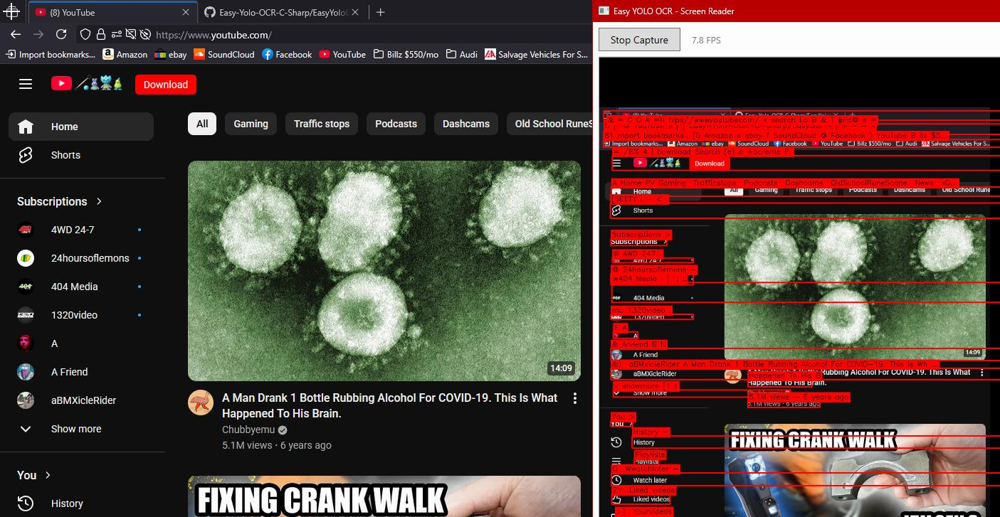

# Easy YOLO OCR — C#



A real-time screen reader and OCR toolkit for .NET 8, combining **YOLO object detection** (via ONNX Runtime) with **Tesseract OCR** and **GPU-accelerated screen capture** (DXGI Desktop Duplication). Ported from the original [Python Easy-Yolo-OCR](https://github.com/JackOfFates/Easy-Yolo-OCR) project.

---

## Features

- **Real-time screen capture** — GPU-accelerated via DXGI Desktop Duplication with zero GDI overhead
- **Live OCR overlay** — detected text is highlighted with red bounding boxes and labels directly on the preview
- **Self-aware masking** — automatically blacks out its own window so it never reads its own UI
- **Foreground window focus** — prioritizes OCR on the active foreground window for faster, more relevant results
- **YOLO + OCR pipeline** — run YOLOv5 ONNX models to detect regions of interest, then OCR the detected areas
- **MRZ / document support** — built-in correction utilities for nationality codes, MRZ fields, and gender characters
- **YAML configuration** — configurable detection model path, image size, confidence, and IOU thresholds
- **Multi-language OCR** — supports any Tesseract language pack (e.g. `eng`, `kor`, `eng+kor`)

## Architecture

```
Easy-Yolo-OCR-C-Sharp/
??? EasyYoloOcr/                    # Core library (.NET 8)
?   ??? Core/
?   ?   ??? OcrEngine.cs            # Tesseract OCR engine with bounding box support
?   ?   ??? YoloDetector.cs         # YOLO inference via ONNX Runtime
?   ?   ??? Scanner.cs              # Detection + OCR pipeline
?   ?   ??? ImagePack.cs            # Image loading, preprocessing, resizing
?   ?   ??? Detection.cs            # Detection result model
?   ?   ??? ScanResult.cs           # Combined detection + OCR result
?   ?   ??? Correction.cs           # MRZ / nationality / text correction
?   ?   ??? DataHandler.cs          # Data I/O utilities
?   ?   ??? Util.cs                 # NMS, box math, helpers
?   ??? AppConfig.cs                # YAML configuration loader
?
??? EasyYoloOcr.Example.Wpf/       # WPF demo app (.NET 8 / Windows)
    ??? MainWindow.xaml/.cs         # Real-time screen reader with overlay
    ??? ScreenCapture.cs            # DXGI Desktop Duplication capture
    ??? tessdata/                   # Tesseract trained data files
```

## Tech Stack

| Component | Library | Version |
|---|---|---|
| Runtime | .NET | 8.0 |
| Object Detection | Microsoft.ML.OnnxRuntime | 1.17.1 |
| Computer Vision | OpenCvSharp4 | 4.9+ |
| OCR | Tesseract (via Tesseract.NET) | 5.2.0 |
| Screen Capture | Vortice.Direct3D11 / DXGI | 3.8.3 |
| Configuration | YamlDotNet | 15.1.2 |
| UI | WPF | .NET 8 |

## Getting Started

### Prerequisites

- [.NET 8 SDK](https://dotnet.microsoft.com/download/dotnet/8.0)
- Windows 10/11 (required for DXGI Desktop Duplication)
- A GPU with DirectX 11+ support

### Clone & Build

```bash
git clone https://github.com/JackOfFates/Easy-Yolo-OCR-C-Sharp.git
cd Easy-Yolo-OCR-C-Sharp
dotnet build
```

### Tesseract Data

The WPF example includes tessdata files that are copied to the output automatically. If you need additional languages, download trained data from [tesseract-ocr/tessdata](https://github.com/tesseract-ocr/tessdata) and place the `.traineddata` files in the `tessdata/` folder next to the executable.

### Run the Screen Reader

```bash
dotnet run --project EasyYoloOcr.Example.Wpf
```

Click **Start Capture** to begin. The app will:

1. Capture your screen at native resolution using DXGI
2. Black out its own window area in the captured frame
3. If another window is in the foreground, focus OCR on that window
4. Draw **red bounding boxes** around every detected text line
5. Show the recognized text as **black text on a red label** above each box
6. Display all recognized text in the bottom panel

### Using the YOLO + OCR Pipeline

For document scanning or custom detection workflows, use the core library directly:

```csharp
using EasyYoloOcr;
using EasyYoloOcr.Core;

// Load config
var config = AppConfig.Load("config.yaml");

// Initialize
using var detector = new YoloDetector(config.Detection);
using var ocr = new OcrEngine("eng");

// Run detection + OCR on an image
var results = Scanner.PtDetect(
    "path/to/image.png",
    detector,
    ciou: 0.5f,
    ocr,
    imgSize: config.DetectionSize,
    confidence: config.DetectionConfidence,
    iou: config.DetectionIou
);

foreach (var result in results)
{
    Console.WriteLine($"[{result.Label}] {result.Text} (conf: {result.Confidence:P0})");
}
```

> **Note:** YOLO models must be exported to ONNX format. If you have a PyTorch `.pt` model, export it first:
> ```bash
> python yolov5/export.py --weights weights/example.pt --include onnx
> ```

## Configuration

Create a `config.yaml` file:

```yaml
images: image
detection: weights/example.onnx
detection-size: 640
detection-confidence: 0.25
detection-iou: 0.25
```

## License

See [LICENSE](LICENSE) for details.
